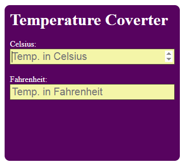
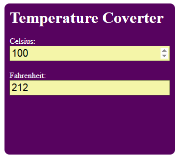

# Temperature Converter App


## 📋 Description

Convert temperatures between Celsius and Fahrenheit instantly. As the user types a temperature in one unit, they see the converted value in the other unit appear in real-time.

**Live Demo:** [View Live](https://alig487.github.io/js-project-03-temperatureCoverter/)

## ✨ Features

- ✅ Input field for Celsius Scale
- ✅ Input field for Fahrenheit Scale
- ✅ Real-time conversion between the two scales
- ✅ Simple design
- ✅ Input validation

## 🎯 Technologies Used

- **HTML5** - Page structure
- **CSS3** - Styling
- **Vanilla JavaScript** - DOM manipulation and logic

## 📸 Screenshots





## 🚀 Quick Start

```bash
# Clone the repository
git clone https://github.com/AliG487/js-project-03-temperatureCoverter

# Navigate to project folder
cd js-project-03-temperatureCoverter

# Open in browser
# Method 1: Direct open
open index.html

# Method 2: Using Python server
python -m http.server 8000
# Visit http://localhost:8000

# Method 3: VS Code Live Server
# Right-click index.html → Open with Live Server
```

## 📖 How to Use

1. Open the application in your browser
2. Enter temperature in one of the input fields
3. See the conversion in real-time

## 🎓 Key Concepts Learned

- **DOM Manipulation** - How to select HTML elements and modify their content
- **Event Listeners** - Handling input events
- **Math Operations** - Implementing temprature conversion formula
- **Two-way Binding** - Changing one input's value changes other input's value
- **HTML Forms** - Creating and handling form inputs

## 🔄 Challenges Faced

Faced no significant difficulty

## 📚 Files Explained

- `index.html` - HTML structure with input field and greeting display
- `style.css` - Styling with gradient background
- `script.js` - JavaScript logic for greeting functionality

## ✅ Features Breakdown

| Feature          | Implementation                                                                     |
| ---------------- | ---------------------------------------------------------------------------------- |
| Input handling   | `querySelector()` and `value` property                                             |
| Temp. Conversion | `celsius.value = (5 / 9) * (tempF - 32)` and `fahren.value = (9 / 5) * tempC + 32` |
| Clear input      | Set `value = ''`                                                                   |

## 🎯 Learning Outcomes

This project helped me understand:

- ✅ How to manipulate the DOM with JavaScript
- ✅ How event listeners work
- ✅ Number parsing and validation
- ✅ Math operations
- ✅ Two-way binding

## 📝 License

MIT License - Feel free to use this project!

## 👨‍💻 Author

**Gohar Ali**

- GitHub: [@AliG487](https://github.com/AliG487)
- Email: engr.ali487@gmail.com

---

Made with ❤️ by Gohar Ali
